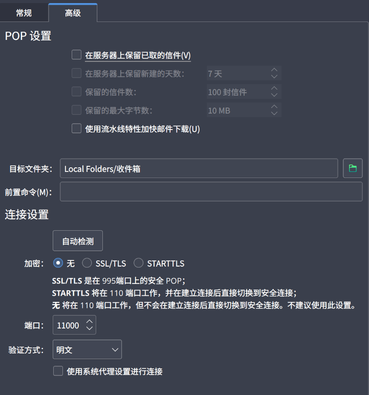

# NEKO MAIL WORKER

A script and local client to allow you release the capability of **sending** and **reciving** emails using cloudflare worker!

Neko Mail Worker is designed to use the power of cloudflare email worker with D1 database and RESTful API to create a mail server, while equipt a basic local client to transform the RESPful API into POP3 and SMTP protocol.

## Usage

Clone this responsetory, and make sure there's node.js on your computer.

Then:

## Configuration

### server side

First, you need to enable Email Routing function on your cloudflare dashboard. There is the [official documentation](https://developers.cloudflare.com/email-routing/).

Then, type following command while link the project to your account:
```bash
cd email_worker/
npm install
npx wranger login
npx wrangler d1 create maildb_d1
```

Copy its output to fill the data in wrangler.toml

**For now, cloudflare hasen't enable the API for email worker. So let's use some alternative way instead.**

Then open wrangler.toml. You should see the `send_mail` field. Edit the `name` field inside it with the email address you will use.

Then open schema.sql and add your admin account. Here is an example:
```sql
drop table if exists users;
create table if not exists users (
    username text primary key,
    password text not null,
    token text not null
);
insert into users (username, password, token) 
    values ('tester@test.com', 'testerpass', 'a_random_token');

drop table if exists meta;
create table if not exists meta (
    token text primary key,
    is_admin boolean not null default 0,
    mail_num integer not null default 0,
    mail_size integer not null default 0
);
insert into meta (token, is_admin, mail_num, mail_size)
    values ('a_random_token', 1, 0, 0);

drop table if exists mail_a_random_token;
create table if not exists mail_a_random_token (
    mail_id integer primary key autoincrement,
    mail_size integer not null,
    mail_content blob not null
);
```

Change the password to someting simple, you will be able to edit from the client to generate a sha256 hashed version after fully setup.

Then deploy the worker with:
```bash
npm run deploy
```

Then connect it to your cloudflare zone:
- Goto the zone you want to use the worker
- Choose EMAIL field

- Edit Catch All rules

- Select "Send to a worker" and your worker


Then create the database with:
```bash
npx wrangler d1 execute maildb_d1 --file=./schema.sql
```

**Now you have successly setup the worker part!**

### client side

Create the `conf.json` inside `local-client` with template `conf_template.json`.

Edit the `server` firld to your worker's address

Edit two ports to whatever you like(notice 25 and 110 maybe used)

Now move back to the project root dir, run:
```bash
cd local-client
npm run compile
npm run start
```

Then, set any of the email client application to connect to the local POP3 and SMTP with your admin account. Here use Kmail as an example:




**Now you are ready to go!!**


# LIMITATIONS

Sadly, due to email worker is still a new thing, cloudflare haven't added the API control to it. So if you want to add a new sender, you **MUST** edit from the binding list...

Though the place is reserved, as long as the cloudflare added the API, we should use this function asap.